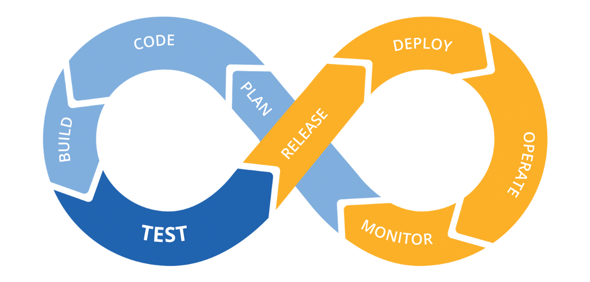

# devops-resources


<center>
<table>
  <tr>
    <td align="center"><a href="#ansible"><br /><b>Ansible</b></a></td>
    <td align="center"><a href="#docker"><br /><b>Docker</b></a></td>
    <td align="center"><a href="#kubernetes"><br /><b>Kubernetes</b></a></td>
    <td align="center"><a href="#jenkins"><br /><b>Jenkins</b></a></td>
    <td align="center"><a href="#git"><br /><b>Git</b></a></td>
    <td align="center"><a href="#AWS"><br /><b>AWS</b></a></td>
    <td align="center"><a href="#linux"><br /><b>Linux</b></a></td>
    <td align="center"><a href="#terraform"><br /><b>Terraform</b></a></td>
    <td align="center"><a href="#python"><br /><b>Python</b></a></td>
    <td align="center"><a href="#cicd"><br /><b>CI/CD</b></a></td>
  </tr>
</table>  
</center> 


## Ansible

<details>
<summary>Ansible</summary><br><b>


</b></details>

## Docker

<details>
<summary>Docker</summary><br><b>

Concepts

The Linux kernel has a number of features that allow a process to be isolated. Container engines such as Docker use two main kernel features to isolate processes: Cgroups and Namespaces. 
- Namespaces
- Cgroups

LXC

Libcontainer

Dockerfile

Each Dockerfile is a script, composed of various commands and arguments listed successively to automatically perform actions on a base image (or from scratch) in order to create a new one.

```bash
# Usage: ADD [source directory or URL] [destination directory]
ADD /my_app_folder /my_app_folder
```

Best practices for writing Dockerfiles [here](https://docs.docker.com/develop/develop-images/dockerfile_best-practices/)


</b></details>

## Kubernetes

<details>
<summary>Kubernetes</summary><br><b>

Kubernetes Basics

- Pod is a group of linked containers which shares a unique IP address. 
- Labels are key-value pairs attached to resources that contain information that helps to identify them. 
- ReplicaSet is a resource that templates the creation of pods. NOTE: ReplicaSet replaces the ReplicaController
- Deployment are used to gracefully roll out new versions of ReplicaSets.
- Services give a way of accessing services within our Kubernetes cluster. 

Kubernetes Components:

Architecture

API server

Controller manager

Scheduler

Kubelet

etcd


Basic Commands:

kubectl set image

kubectl get pods

kubectl delete pod XX

kubectl scale XX

Configuration as Code:

```yaml
apiVersion: apps/v1
kind: Deployment
metadata:
  name: nginx-deployment
  labels:
    app: nginx
spec:
  replicas: 3
  selector:
    matchLabels:
      app: nginx
  template:
    metadata:
      labels:
        app: nginx
    spec:
      containers:
      - name: nginx
        image: nginx:1.7.9
        ports:
        - containerPort: 80
```

service.yaml

EKS Cluster Setup

IAM

Helm

Planning for Production Deployments
</b></details>

<details>
<summary>EKS</summary><br><b>
</b></details>

<details>
<summary>GKE</summary><br><b>

Create a cluster
```bash
gcloud container clusters create mycluster
```

</b></details>

## Jenkins

<details>
<summary>Jenkins</summary><br><b>

```groovy
pipeline {
  agent none
  environment {
      JUNIT_REPORTS_FOLDER = "**/target/surefire-reports/*.xml" /* set junit reports folder variable */
  }
  options {
      skipDefaultCheckout true /* skips the default repository checkout for testing the 'stash/unstash' feature behaviour */
  }
  stages {
      stage('Checkout code by slave-01') {
          agent {
              label 'slave-01' /* this stage executor and workspace is allocated in slave-01 node */
          }  
          steps {
            checkout scm /* checkout source repository */
            stash includes: '**', name: 'repository_code' /* stores code to be handed over to slave-02 */
          }
      }
      stage('Maven compile by slave-01') {
          agent {
              label 'slave-01' /* this stage executor and workspace is allocated in slave-01 node */
          }
          steps {
              echo "-----------------------------------------------------------------------------------------------------------------"
              echo "Maven Compile by Slave 01 "
              echo "-----------------------------------------------------------------------------------------------------------------"
              sh 'mvn compile' /* compile source code */
          }
          post {
              always {
                  deleteDir() /* workspace clean up */
              }
          }
      }  
      stage('Maven testing by slave-02') {
          agent {
              label 'slave-02' /* this stage executor and workspace is allocated in slave-02 node */
          }
          steps {
              echo "-----------------------------------------------------------------------------------------------------------------"
              echo "Maven Application Testing by Slave 02"
              echo "-----------------------------------------------------------------------------------------------------------------"
              unstash 'repository_code' /* retrieves code stored by slave-01 */
              sh 'mvn test' /* test the compiled source code using unit testing framework */
          }
      }
      stage('Publish testing reports by slave-02') {
          agent {
              label 'slave-02' /* this stage executor and workspace is allocated in slave-02 node */
          }
          steps {
              echo "-----------------------------------------------------------------------------------------------------------------"
              echo "Publish Testing Reports by Slave 02"
              echo "-----------------------------------------------------------------------------------------------------------------"
          }
          post {
              always {
                  junit "${JUNIT_REPORTS_FOLDER}" /* publish unit testing reports */
                  deleteDir() /* workspace clean up */
              }
          }
      }
   }
}
```
  


</b></details>

## Git

<details>
<summary>Git</summary><br><b>

Git rebase details [here](https://git-scm.com/docs/git-rebase)


</b></details>

## AWS

<details>
<summary>AWS</summary><br><b>


</b></details>

## Linux

<details>
<summary>Linux</summary><br><b>


</b></details>


## Terraform

<details>
<summary>Terraform</summary><br><b>


</b></details>

## Python

<details>
<summary>Python</summary><br><b>

For more info please read [here](https://www.google.com)

</b></details>

## CICD

<details>
<summary>CICD</summary><br><b>
  
The Software Development Life Cycle (SDLC) model covers the following phases:

1. Planning
2. Implementation
3. Testing
4. Documentation
5. Deployment and maintenance
6. Maintaining

  
Some of the advantages are:

- Speed of deployment
- Faster testing and analysis
- Smaller code changes
- Better and faster fault isolation
- Increased code coverage
- Automatic deploy to production
- Never ship broken code
- Process is repeatable
- Faster mean time to resolution
- Smaller backlog
- Improved customer satisfaction
- Tons of open source tools available

The disadvantages of CI/CD are:

- New skill sets must be learned
- Big upfront investment
- Legacy systems rarely support CI/CD
- High degree of discipline and dedication to quality

For more info please read [here](https://www.google.com)

</b></details>
